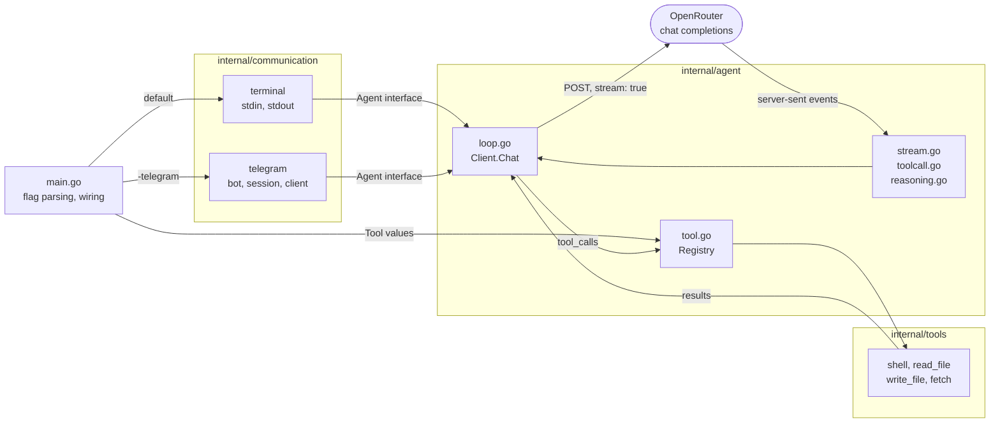
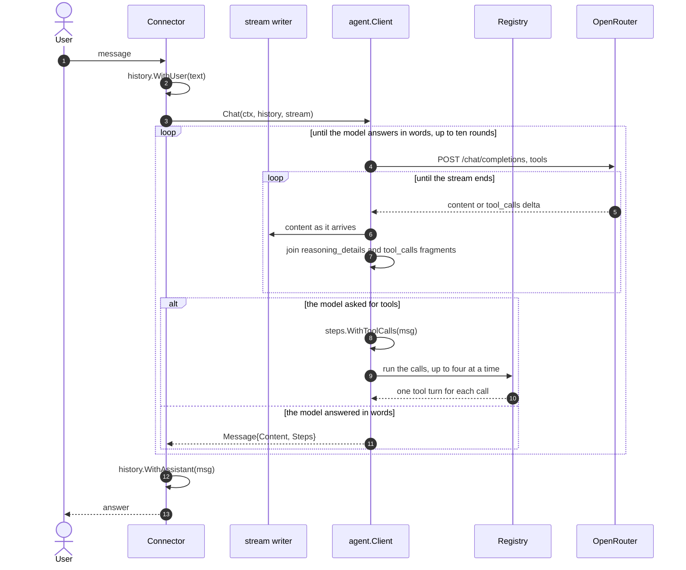

# my-agent

A small agent that talks to a model through the [OpenRouter](https://openrouter.ai) chat completions API, runs the tools the model asks for, and streams the answer as it arrives.

It shows three things that are easy to get wrong:

- server-sent events parsing, including OpenRouter keep-alive comment lines
- reassembling streamed `tool_calls` fragments, which arrive indexed and split across chunks, and running a round of them before asking the model again
- reassembling streamed `reasoning_details` fragments so the model's thinking can be replayed in a follow-up turn, kept for when reasoning is switched on

It runs in the terminal, or as a Telegram bot.



A connector depends on the agent, never the other way round.

## Requirements

- Go 1.26 or newer
- An OpenRouter API key

## Usage

```sh
export OPENROUTER_API_KEY=sk-or-...
go run .
```

Optionally set `MY_AGENT_MODEL` to override the model, for example:

```sh
export MY_AGENT_MODEL=openai/gpt-4o
go run .
```

Type a message at the `you>` prompt and press enter. The whole conversation is sent back on every turn. Ctrl-C or Ctrl-D exits.

The answer streams in as it arrives. A failed turn prints the error and drops the unanswered message, leaving the session alive.

Reasoning is off: every request sends `"reasoning": {"enabled": false}`, so the model returns an answer and no thinking. Turning it on makes the model stream `reasoning` and `reasoning_details` too, which `internal/agent` already reassembles and replays on the next turn - the terminal prints it under a `--- reasoning ---` header, above the answer under `--- answer ---`.

## Tools

The model does not only answer, it can act. Four tools ship today:

| Tool | What it does |
| --- | --- |
| `shell` | runs a command line with `sh -c` and returns the combined output |
| `read_file` | returns the text of a file |
| `write_file` | replaces the content of a file and creates the parent directories |
| `fetch` | gets a URL and returns the status and the body |

`-workdir` says where the first three of them work. It is the current directory
by default:

```sh
go run . -workdir ~/Code/some-project
```

One turn can take several rounds. `Chat` sends the tool schemas with the
request; if the model answers with `tool_calls` instead of words, the loop runs
the calls, appends one `tool` turn for each of them, and asks the model again.
It stops on a plain answer, or after ten rounds. Independent calls of one round
run at the same time, up to four.

A tool that fails reports the failure to the model as text, so a command that
exits non-zero is an answer the model can read and work around, not a broken
turn. Output is cut to the last 8000 bytes, because the whole result goes back
into the history on every later turn.

> The tools run on the machine the agent runs on. The sandbox that gives each
> chat its own container comes next.

## Telegram bot

Talk to [@BotFather](https://t.me/BotFather), send `/newbot`, and keep the token it gives you.

```sh
export OPENROUTER_API_KEY=sk-or-...
export TELEGRAM_BOT_TOKEN=123456:ABC-DEF...
export TELEGRAM_ALLOWED_USERS=11111111,22222222
go run . -telegram
```

The bot long-polls `getUpdates` for `message` updates, keeps one conversation per chat, and answers each message with the model. Commands:

- `/start`, `/help` - what the bot does
- `/reset` - forget the conversation in that chat

Details worth knowing:

- `TELEGRAM_ALLOWED_USERS` is a comma-separated list of numeric Telegram user ids. Anyone can find a bot by its username, so without an allowlist strangers spend your OpenRouter credits. Ask [@userinfobot](https://t.me/userinfobot) for your id
- each chat is served by its own goroutine, so a slow answer in one chat does not block another. Messages inside one chat are answered in order, and a sender who runs ahead of the queue is told to wait
- history is capped at the last 10 turns per chat and lives in memory only, so a restart clears it
- answers longer than Telegram's 4096 character limit are split on the last blank line, newline or space that fits
- a `429` from Telegram is retried after the `retry_after` it returns, other poll failures back off up to a minute
- Ctrl-C or `SIGTERM` stops the bot

## Deploying to Railway

The bot has no HTTP server, so it is a worker service: no port, no healthcheck. Railpack builds the Go binary as `out`, and `railway.json` starts it with the flag:

```json
{
  "$schema": "https://railway.com/railway.schema.json",
  "deploy": {
    "startCommand": "./out -telegram",
    "restartPolicyType": "ALWAYS"
  }
}
```

Set `OPENROUTER_API_KEY`, `TELEGRAM_BOT_TOKEN` and `TELEGRAM_ALLOWED_USERS` as service variables. The same command can be typed into Settings -> Deploy -> Custom Start Command instead, but the checked-in file survives a service being recreated.

Only one instance may poll `getUpdates` at a time, so keep the service at a single replica.

## Configuration

The model is set by the `MY_AGENT_MODEL` environment variable. The agent reads it at startup; if unset `Model` is the empty string and OpenRouter uses its own default.

## How a turn works



The `stream` writer is where the reply appears while it is still arriving. The
terminal passes `os.Stdout`, so the answer types itself out. Telegram cannot
edit a message per token, so it passes `io.Discard` and sends the finished
answer in one go.

`Steps` carries the tool calls and the tool results of the round.
`WithAssistant` puts them into the history in front of the answer, so the next
turn replays what the agent did and the connector never has to know the
`tool_calls` wire format.

`ReasoningDetails` goes back into the history with the assistant turn, so the
model can follow up on its own thinking. It is empty while reasoning is off. A
turn the model failed to answer is dropped with `DropLast`, so a broken turn
never poisons the history.

## Layout

```
main.go                              flag parsing and wiring
internal/agent/                      the model: OpenRouter client, SSE stream, tool loop, history
internal/tools/                      what the agent can do: shell, files, fetch
internal/communication/terminal/     stdin and stdout connector
internal/communication/telegram/     Telegram bot connector
```

A connector depends on the agent, never the other way round. Each one takes an
`Agent` interface - `Model() string` and `Chat(ctx, history, stream)` - so a new
connector is a new folder under `internal/communication` and a branch in
`main.go`. `CLAUDE.md` has the file-by-file breakdown.
