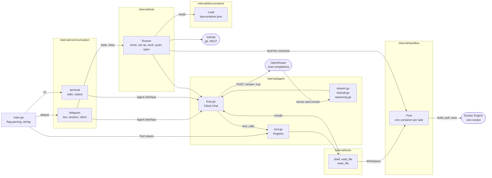
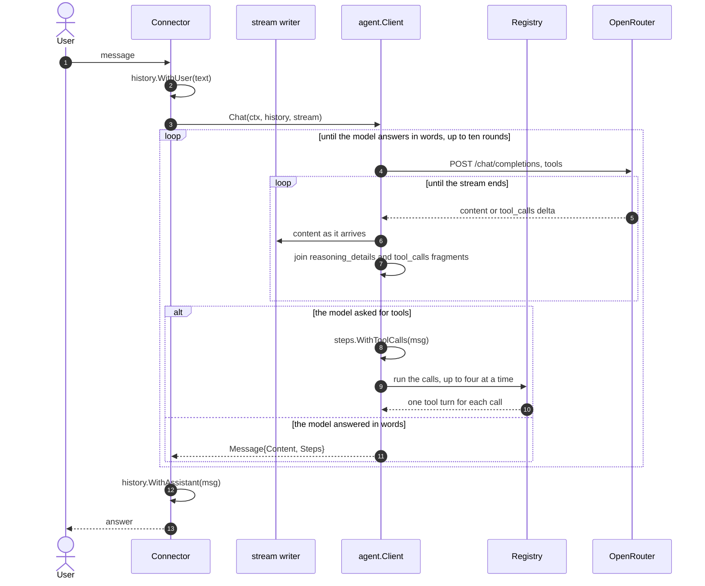

# my-agent

A small agent that talks to a model through the [OpenRouter](https://openrouter.ai) chat completions API, runs the tools the model asks for, and streams the answer as it arrives.

One message from a phone - "fix the lint warning in my-agent" - clones the
repository, changes it in its own dev container, runs the tests, pushes a
branch and answers with a link to the pull request.

It shows six things that are easy to get wrong:

- server-sent events parsing, including OpenRouter keep-alive comment lines
- reassembling streamed `tool_calls` fragments, which arrive indexed and split across chunks, and running a round of them before asking the model again
- reassembling streamed `reasoning_details` fragments so the model's thinking can be replayed in a follow-up turn, kept for when reasoning is switched on
- reading `devcontainer.json`, which is JSON with comments, with nothing but `encoding/json`
- driving the Docker Engine API over its unix socket with nothing but `net/http`, to build or pull that dev container and run the tools inside it
- stopping a run from the phone half way through, without losing the chat

It runs as a Telegram bot, or in the terminal with `-cli`.



A connector depends on the agent, never the other way round.

## Requirements

- Go 1.26 or newer
- An OpenRouter API key
- A Telegram bot token, for the default mode
- A Docker daemon and a GitHub token, for `/task`

## Usage

```sh
export OPENROUTER_API_KEY=sk-or-...
go run . -cli
```

Optionally set `MY_AGENT_MODEL` to override the model, for example:

```sh
export MY_AGENT_MODEL=openai/gpt-4o
go run . -cli
```

Type a message at the `you>` prompt and press enter. The whole conversation is sent back on every turn. Ctrl-C or Ctrl-D exits.

The answer streams in as it arrives. A failed turn prints the error and drops the unanswered message, leaving the session alive.

A chat, in the terminal or in Telegram, offers the model no tools: it answers
in words. Work on a repository goes through `/task`, in the dev container of
that repository.

Reasoning is off: every request sends `"reasoning": {"enabled": false}`, so the model returns an answer and no thinking. Turning it on makes the model stream `reasoning` and `reasoning_details` too, which `internal/agent` already reassembles and replays on the next turn - the terminal prints it under a `--- reasoning ---` header, above the answer under `--- answer ---`.

## Tools

In a task the model does not only answer, it acts. Three tools ship today:

| Tool | What it does |
| --- | --- |
| `shell` | runs a command line with `sh -c` and returns the combined output |
| `read_file` | returns the text of a file |
| `write_file` | replaces the content of a file and creates the parent directories |

One turn can take several rounds. `Chat` sends the tool schemas with the
request; if the model answers with `tool_calls` instead of words, the loop runs
the calls, appends one `tool` turn for each of them, and asks the model again.
It stops on a plain answer, or after ten rounds. Independent calls of one round
run at the same time, up to four.

A tool that fails reports the failure to the model as text, so a command that
exits non-zero is an answer the model can read and work around, not a broken
turn. Output is cut to the last 8000 bytes, because the whole result goes back
into the history on every later turn.

A tool never touches the host. It works through a `Workspace`, which is the dev
container of the task the call belongs to. No tool call waits for a person: the
container is the boundary.

## The dev container

A task works in the environment the repository describes for itself, with the
[dev container standard](https://containers.dev). The agent looks for the file
in the order the specification gives:

1. `.devcontainer/devcontainer.json`
2. `.devcontainer.json`
3. `.devcontainer/<folder>/devcontainer.json`

A repository without one cannot run a task, and the chat is told so. A root
`Dockerfile` is for production, and the agent never reads it.

What the agent does with the file:

| Property | What happens |
| --- | --- |
| `image` | pulled, unless the daemon already has it |
| `build.dockerfile`, `build.context`, `build.args`, `build.target` | built through `POST /build`, with the context sent as a tar |
| `workspaceFolder` | where the checkout is mounted, `/workspaces/<repository>` by default |
| `containerEnv`, `containerUser` | set on the container |
| `remoteEnv`, `remoteUser` | set on every command the tools run |
| `onCreateCommand`, `updateContentCommand`, `postCreateCommand`, `postStartCommand` | run in that order before the model starts. One that fails stops the task |

`dockerComposeFile` stops the task. `features`, `initializeCommand`,
`workspaceMount`, `mounts` and `runArgs` are skipped, and the chat is told
which ones. `${localEnv:NAME}` is replaced with its default only, never with
the value on the host, because the host holds `GITHUB_TOKEN`.

The container of a task:

| When | What happens |
| --- | --- |
| the task sets up | the container starts with the checkout mounted and the default Docker network |
| the task ends, fails or is stopped | the container is removed |
| 30 minutes without a command | a reaper removes it |
| the agent stops | every container it started is removed |
| the agent starts | the containers of an earlier run are removed |

`internal/sandbox` speaks the Docker Engine API itself, over the unix socket,
with `net/http` and its own `DialContext`. That is what keeps `go.mod` free of
requirements. The calls it makes: pull or build an image, create and start a
container, create and start an exec, and put or get a tar through the archive
endpoint, because the API has no endpoint that takes a plain file.

This repository describes itself in `.devcontainer/devcontainer.json`, with
`golang:1.26`.

## A task, end to end

`/task owner/name what to change` is the whole point of the project. From a
phone:

```
/task skryvets/my-agent fix the lint warning in internal/agent
```

The bot answers as it goes, because a run takes minutes:

```
Cloning skryvets/my-agent
Starting the dev container
Working on it
I removed the unused import in stream.go and go vet is clean.
Pushing my-agent/20260912-134544-1
Pull request open: https://github.com/skryvets/my-agent/pull/8
```

What happens, and where:

| Step | Where it runs |
| --- | --- |
| clone the repository | the agent process, with the token |
| read `devcontainer.json` | the agent process |
| build or pull the image, lend it the checkout | Docker, through a bind mount |
| run the setup commands | inside the container |
| read, change and test the code | the model, inside the container |
| name the change | the model, with no tools |
| commit and push the branch | the agent process, with the token |
| open the pull request | the agent process, GitHub REST |

**git and the GitHub API never run inside the container.** The model therefore
never sees the token: it works on a checkout the agent lends it through a bind
mount, and the two steps that publish the change are made by code rather than
by the model. The container has the default network, so the setup and the
tests can download what they need.

`GITHUB_TOKEN` needs write access to the repository. Without it `/task` is off,
and the bot needs no Docker.

`/stop` ends a run where it is. The model call or the command under way is
cancelled, the container is removed, the run is recorded as `stopped`, and the
messages that wait in that chat are dropped. A branch that was already pushed
stays on GitHub.

Every run is written to `-state` (`state` by default) at each step, so a
restart knows what was under way. A run it caught in the middle is marked and
reported to its chat, with the branch it reached:

```
A restart stopped the task on skryvets/my-agent (fix the lint warning).
It reached the state "working" on the branch my-agent/20260912-134544-1.
Send it again to start over.
```

## Telegram bot

Talk to [@BotFather](https://t.me/BotFather), send `/newbot`, and keep the token it gives you.

```sh
export OPENROUTER_API_KEY=sk-or-...
export TELEGRAM_BOT_TOKEN=123456:ABC-DEF...
export TELEGRAM_ALLOWED_USERS=11111111,22222222
export GITHUB_TOKEN=github_pat_...
go run .
```

The bot long-polls `getUpdates` for `message` updates, keeps one conversation per chat, and answers each message with the model. Commands:

- `/start`, `/help` - what the bot does
- `/task owner/name what to change` - change a repository in its dev container and open a pull request
- `/stop` - stop the answer or the task under way in that chat, and drop the messages that wait
- `/reset` - forget the conversation in that chat

Details worth knowing:

- `TELEGRAM_ALLOWED_USERS` is a comma-separated list of numeric Telegram user ids. Anyone can find a bot by its username, so without an allowlist strangers spend your OpenRouter credits. Ask [@userinfobot](https://t.me/userinfobot) for your id
- each chat is served by its own goroutine, so a slow answer in one chat does not block another. Messages inside one chat are answered in order, and a sender who runs ahead of the queue is told to wait
- `/stop` is read as it arrives, not in the queue of the chat, because the queue waits behind the very message it has to stop
- history is capped at the last 10 turns per chat and lives in memory only, so a restart clears it
- answers longer than Telegram's 4096 character limit are split on the last blank line, newline or space that fits
- a `429` from Telegram is retried after the `retry_after` it returns, other poll failures back off up to a minute
- Ctrl-C or `SIGTERM` stops the bot

## Deploying

The bot has no HTTP server, so it needs no port. `/task` needs a Docker daemon
the agent can reach at `/var/run/docker.sock`, so the bot runs on a machine
with Docker: a VM or a server, not a platform that gives a service no socket.

```sh
go build -o my-agent .
./my-agent
```

Run it under a supervisor that restarts it, with the variables above. Only one
instance may poll `getUpdates` at a time, so keep it to one. Point `-state` at
a directory that survives a restart.

The daemon resolves the bind mount of a checkout on its own host. When the
agent itself runs in a container with the socket mounted, set `TMPDIR` to a
directory that is mounted at the same path inside and outside it.

## Configuration

The model is set by the `MY_AGENT_MODEL` environment variable. The agent reads it at startup; if unset `Model` is the empty string and OpenRouter uses its own default.

## How a turn works



In a chat the client offers no tools, so the loop ends on the first round. In a
task the client offers the three tools, and the task runner is the caller.

The `stream` writer is where the reply appears while it is still arriving. The
terminal passes `os.Stdout`, so the answer types itself out. Telegram cannot
edit a message per token, so it passes `io.Discard` and sends the finished
answer in one go.

`Steps` carries the tool calls and the tool results of the round.
`WithAssistant` puts them into the history in front of the answer, so the next
turn replays what the agent did and the connector never has to know the
`tool_calls` wire format.

`ReasoningDetails` goes back into the history with the assistant turn, so the
model can follow up on its own thinking. It is empty while reasoning is off. A
turn the model failed to answer is dropped with `DropLast`, so a broken turn
never poisons the history.

## Layout

```
main.go                              flag parsing and wiring
internal/agent/                      the model: OpenRouter client, SSE stream, tool loop, history
internal/tools/                      what the agent can do in a dev container: shell, files
internal/devcontainer/               the environment a repository describes for itself
internal/conversation/               which conversation a call belongs to
internal/task/                       a job end to end: clone, set up, work, push, open a pull request
internal/sandbox/                    a Docker container for each task
internal/communication/telegram/     Telegram bot connector, the default
internal/communication/terminal/     stdin and stdout connector, with -cli
```

A connector depends on the agent, never the other way round. Each one takes an
`Agent` interface - `Model() string` and `Chat(ctx, history, stream)` - so a new
connector is a new folder under `internal/communication` and a branch in
`main.go`. `CLAUDE.md` has the file-by-file breakdown.
