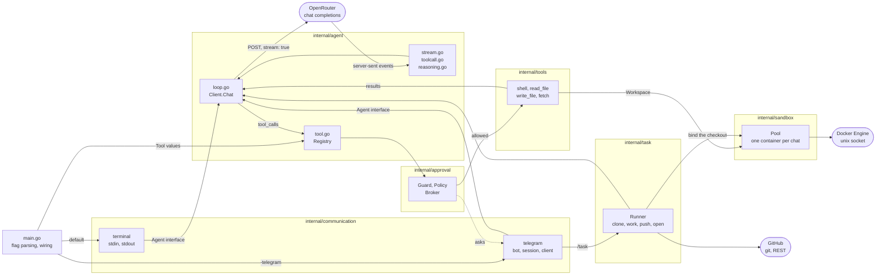
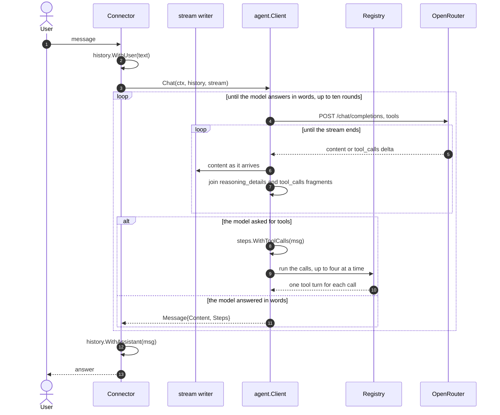

# my-agent

A small agent that talks to a model through the [OpenRouter](https://openrouter.ai) chat completions API, runs the tools the model asks for, and streams the answer as it arrives.

One message from a phone - "fix the lint warning in my-agent" - clones the
repository, changes it in a container, runs the tests, pushes a branch and
answers with a link to the pull request.

It shows five things that are easy to get wrong:

- server-sent events parsing, including OpenRouter keep-alive comment lines
- reassembling streamed `tool_calls` fragments, which arrive indexed and split across chunks, and running a round of them before asking the model again
- reassembling streamed `reasoning_details` fragments so the model's thinking can be replayed in a follow-up turn, kept for when reasoning is switched on
- driving the Docker Engine API over its unix socket with nothing but `net/http`, so each conversation works in a container of its own
- holding a tool call open while a person answers Approve or Deny on their phone

It runs in the terminal, or as a Telegram bot.



A connector depends on the agent, never the other way round.

## Requirements

- Go 1.26 or newer
- An OpenRouter API key

## Usage

```sh
export OPENROUTER_API_KEY=sk-or-...
go run .
```

Optionally set `MY_AGENT_MODEL` to override the model, for example:

```sh
export MY_AGENT_MODEL=openai/gpt-4o
go run .
```

Type a message at the `you>` prompt and press enter. The whole conversation is sent back on every turn. Ctrl-C or Ctrl-D exits.

The answer streams in as it arrives. A failed turn prints the error and drops the unanswered message, leaving the session alive.

Reasoning is off: every request sends `"reasoning": {"enabled": false}`, so the model returns an answer and no thinking. Turning it on makes the model stream `reasoning` and `reasoning_details` too, which `internal/agent` already reassembles and replays on the next turn - the terminal prints it under a `--- reasoning ---` header, above the answer under `--- answer ---`.

## Tools

The model does not only answer, it can act. Four tools ship today:

| Tool | What it does |
| --- | --- |
| `shell` | runs a command line with `sh -c` and returns the combined output |
| `read_file` | returns the text of a file |
| `write_file` | replaces the content of a file and creates the parent directories |
| `fetch` | gets a URL and returns the status and the body |

`-workdir` says where the first three of them work on the host. It is the
current directory by default:

```sh
go run . -workdir ~/Code/some-project
```

One turn can take several rounds. `Chat` sends the tool schemas with the
request; if the model answers with `tool_calls` instead of words, the loop runs
the calls, appends one `tool` turn for each of them, and asks the model again.
It stops on a plain answer, or after ten rounds. Independent calls of one round
run at the same time, up to four.

A tool that fails reports the failure to the model as text, so a command that
exits non-zero is an answer the model can read and work around, not a broken
turn. Output is cut to the last 8000 bytes, because the whole result goes back
into the history on every later turn.

A tool never touches the host directly. It works through a `Workspace`, which
is the host in a terminal chat and a container with `-sandbox`. A tool cannot
tell the two apart.

## Sandbox

`-sandbox` gives every conversation its own Docker container and runs the tools
inside it:

```sh
go run . -sandbox
go run . -sandbox -image node:20
```

The container starts from `golang:1.26`, works in `/work` and has
**no network of its own**: `NetworkMode` is `none`, so a command inside it
cannot reach the internet, the host, or another container. A command that
leaves a mess leaves it in a container that is thrown away.

| When | What happens |
| --- | --- |
| the first tool call of a chat | a container starts for that chat alone |
| `/reset` | the container is removed with everything written in it |
| 30 minutes without a command | a reaper removes it |
| the agent stops | every container it started is removed |
| the agent starts | the containers of an earlier run are removed |

The last line matters on Railway, where a restart would otherwise leave one
container for every chat that was open.

Which conversation a call belongs to travels in the context, so one shared
agent serves every chat and each one still gets its own container. A connector
names the conversation through a small interface it declares, and never imports
the sandbox.

`internal/sandbox` speaks the Docker Engine API itself, over the unix socket,
with `net/http` and its own `DialContext`. That is what keeps `go.mod` free of
requirements. Four calls do the work: create and start a container, create and
start an exec, and put or get a tar through the archive endpoint, because the
API has no endpoint that takes a plain file.

`fetch` is the one tool that stays outside the sandbox: it runs in the agent
process, so it still reaches the network. That is why the policy below never
lets it through on its own.

## Asking first

The agent asks a person before a call the policy does not allow by itself. It
is on by default, and `-approval=false` turns it off.

What runs with nobody watching:

- `read_file` and `write_file`, because they stay inside the workspace
- `shell`, when **every** part of the command line is a known program: `ls`,
  `cat`, `grep`, `go`, `git`, `node`, `make` and a few more

What waits for a person:

- `fetch`, always, because it reaches the network
- any command with a program the list does not name
- any command with `$(...)` or backticks, because a substitution can hide one
  program inside another
- any tool nobody has named, so a tool added later is gated until someone
  decides otherwise

The check walks every part of the command line, split on `;`, `|` and `&`. One
allowed program at the front says nothing about what follows the semicolon, so
`ls && curl evil.example` waits for a person while `ls | head -3` does not.

In Telegram the question arrives as a message with **Approve** and **Deny**
under it. The tool call blocks until a button is pressed, the buttons are then
replaced by the decision, and five minutes of silence counts as a no. In a
terminal chat the same question is a `[y/N]` prompt.

A refused call is reported to the model as text, not as a failure, so it
explains what it wanted and tries another way instead of asking again.

## A task, end to end

`/task owner/name what to change` is the whole point of the project. From a
phone:

```
/task skryvets/my-agent fix the lint warning in internal/agent
```

The bot answers as it goes, because a run takes minutes:

```
Cloning skryvets/my-agent
Working on it
I removed the unused import in stream.go and go vet is clean.
Pushing my-agent/20260912-134544-1
Pull request open: https://github.com/skryvets/my-agent/pull/8
```

What happens, and where:

| Step | Where it runs |
| --- | --- |
| clone the repository | the agent process, with the token |
| lend the checkout to a container | Docker, `--network none` |
| read, change and test the code | the model, inside that container |
| name the change | the model, with no tools |
| commit and push the branch | the agent process, with the token |
| open the pull request | the agent process, GitHub REST |

**git and the GitHub API never run inside the container.** The model therefore
never sees the token and never needs a network: it works on a checkout the
agent lends it through a bind mount, and the two steps that leave the machine
are made by code rather than by the model. It is also the answer to a plain
conflict: a container with `--network none` cannot clone.

`GITHUB_TOKEN` needs write access to the repository. `/task` needs `-sandbox`
as well, and says so when it is missing.

Every run is written to `-state` (`state` by default) at each step, so a
restart knows what was under way. A run it caught in the middle is marked and
reported to its chat, with the branch it reached:

```
A restart stopped the task on skryvets/my-agent (fix the lint warning).
It reached the state "working" on the branch my-agent/20260912-134544-1.
Send it again to start over.
```

## Telegram bot

Talk to [@BotFather](https://t.me/BotFather), send `/newbot`, and keep the token it gives you.

```sh
export OPENROUTER_API_KEY=sk-or-...
export TELEGRAM_BOT_TOKEN=123456:ABC-DEF...
export TELEGRAM_ALLOWED_USERS=11111111,22222222
go run . -telegram
```

The bot long-polls `getUpdates` for `message` updates, keeps one conversation per chat, and answers each message with the model. Commands:

- `/start`, `/help` - what the bot does
- `/reset` - forget the conversation in that chat, and throw away its container

- `/task owner/name what to change` - change a repository and open a pull request

A tool call the policy does not allow by itself arrives as a question with
**Approve** and **Deny** under it, and the turn waits for the answer.

Details worth knowing:

- `TELEGRAM_ALLOWED_USERS` is a comma-separated list of numeric Telegram user ids. Anyone can find a bot by its username, so without an allowlist strangers spend your OpenRouter credits. Ask [@userinfobot](https://t.me/userinfobot) for your id
- each chat is served by its own goroutine, so a slow answer in one chat does not block another. Messages inside one chat are answered in order, and a sender who runs ahead of the queue is told to wait
- history is capped at the last 10 turns per chat and lives in memory only, so a restart clears it
- answers longer than Telegram's 4096 character limit are split on the last blank line, newline or space that fits
- a `429` from Telegram is retried after the `retry_after` it returns, other poll failures back off up to a minute
- Ctrl-C or `SIGTERM` stops the bot

## Deploying to Railway

The bot has no HTTP server, so it is a worker service: no port, no healthcheck. Railpack builds the Go binary as `out`, and `railway.json` starts it with the flag:

```json
{
  "$schema": "https://railway.com/railway.schema.json",
  "deploy": {
    "startCommand": "./out -telegram",
    "restartPolicyType": "ALWAYS"
  }
}
```

Set `OPENROUTER_API_KEY`, `TELEGRAM_BOT_TOKEN` and `TELEGRAM_ALLOWED_USERS` as service variables, and `GITHUB_TOKEN` for `/task`. The same command can be typed into Settings -> Deploy -> Custom Start Command instead, but the checked-in file survives a service being recreated.

Only one instance may poll `getUpdates` at a time, so keep the service at a single replica.

Railway gives a worker service no Docker socket, so `-sandbox` does not work
there, and `/task` needs it. The deployed bot answers and runs its tools inside
its own Railway container, which is isolation of a kind, but one container for
every chat instead of one for each. Run the bot on a machine with Docker to get
the sandbox and the pull requests.

`-state` should point at a Railway volume, so the runs of a task survive the
restart of a deployment.

## Configuration

The model is set by the `MY_AGENT_MODEL` environment variable. The agent reads it at startup; if unset `Model` is the empty string and OpenRouter uses its own default.

## How a turn works



The `stream` writer is where the reply appears while it is still arriving. The
terminal passes `os.Stdout`, so the answer types itself out. Telegram cannot
edit a message per token, so it passes `io.Discard` and sends the finished
answer in one go.

`Steps` carries the tool calls and the tool results of the round.
`WithAssistant` puts them into the history in front of the answer, so the next
turn replays what the agent did and the connector never has to know the
`tool_calls` wire format.

`ReasoningDetails` goes back into the history with the assistant turn, so the
model can follow up on its own thinking. It is empty while reasoning is off. A
turn the model failed to answer is dropped with `DropLast`, so a broken turn
never poisons the history.

## Layout

```
main.go                              flag parsing and wiring
internal/agent/                      the model: OpenRouter client, SSE stream, tool loop, history
internal/tools/                      what the agent can do: shell, files, fetch
internal/approval/                   the person in the loop: policy, guard, broker
internal/conversation/               which conversation a call belongs to
internal/task/                       a job end to end: clone, work, push, open a pull request
internal/sandbox/                    a Docker container for each conversation
internal/communication/terminal/     stdin and stdout connector
internal/communication/telegram/     Telegram bot connector
```

A connector depends on the agent, never the other way round. Each one takes an
`Agent` interface - `Model() string` and `Chat(ctx, history, stream)` - so a new
connector is a new folder under `internal/communication` and a branch in
`main.go`. `CLAUDE.md` has the file-by-file breakdown.
